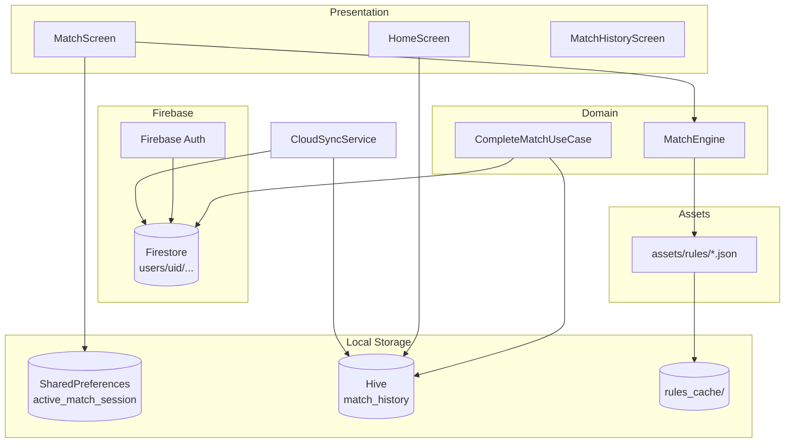
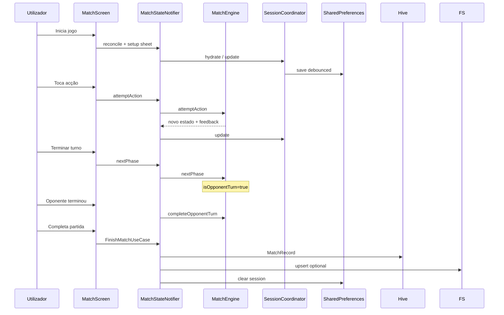
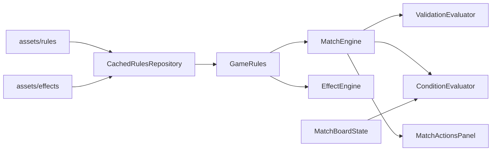

# TurnWise TCG — Documentação Técnica da Arquitetura

**Versão do documento:** 1.0  
**Projeto:** `turnwise_tcg` (Flutter)  
**Última atualização:** Maio 2026  

Este documento descreve, de forma técnica e detalhada, a arquitetura do TurnWise: organização do código, fluxos de dados, persistência, motor de partida, integrações Firebase e convenções de engenharia.

---

## Índice

1. [Visão geral](#1-visão-geral)
2. [Stack tecnológica](#2-stack-tecnológica)
3. [Arquitetura em camadas](#3-arquitetura-em-camadas)
4. [Estrutura de pastas](#4-estrutura-de-pastas)
5. [Bootstrap e ciclo de vida](#5-bootstrap-e-ciclo-de-vida)
6. [Navegação e rotas](#6-navegação-e-rotas)
7. [Gestão de estado (Riverpod)](#7-gestão-de-estado-riverpod)
8. [Persistência e bases de dados](#8-persistência-e-bases-de-dados)
9. [Sincronização cloud (Firestore ↔ Hive)](#9-sincronização-cloud-firestore--hive)
10. [Motor de partida (Match Engine)](#10-motor-de-partida-match-engine)
11. [Regras declarativas (JSON)](#11-regras-declarativas-json)
12. [Features do produto](#12-features-do-produto)
13. [Autenticação](#13-autenticação)
14. [Observabilidade](#14-observabilidade)
15. [Tema, UI compartilhada e feedback](#15-tema-ui-compartilhada-e-feedback)
16. [Testes](#16-testes)
17. [Build, assets e plataformas](#17-build-assets-e-plataformas)
18. [Diagramas](#18-diagramas)
19. [Decisões e limitações conhecidas](#19-decisões-e-limitações-conhecidas)

---

## 1. Visão geral

O **TurnWise** é uma aplicação móvel (Flutter) para **acompanhar partidas de TCG** (Trading Card Game). Não substitui o árbitro oficial do torneio: combina **tracker honesto** (lembretes + bloqueios onde o estado do tabuleiro é conhecido) com regras carregadas de **JSON em assets**.

### Objetivos técnicos principais

| Objetivo | Como é atingido |
|----------|-----------------|
| Regras por jogo sem rede | `assets/rules/*.json` + `assets/rules/effects/*` |
| Partida recuperável após fechar app | `MatchSession` em SharedPreferences |
| Histórico offline-first | Hive como fonte de leitura local |
| Backup multi-dispositivo | Firestore sob `users/{uid}/...` |
| Lógica testável | Domain puro (`MatchEngine`, evaluators) |
| UI reativa | Riverpod + GoRouter |

### TCGs suportados (bundled)

`pokemon`, `one_piece`, `yugioh`, `lorcana`, `magic`, `flesh_and_blood`, `riftbound` — definidos em `assets/games_manifest.json`.

---

## 2. Stack tecnológica

| Camada | Tecnologia | Versão (pubspec) |
|--------|------------|------------------|
| Framework | Flutter / Dart | SDK `>=3.4.0 <4.0.0` |
| Estado | flutter_riverpod | ^2.6.1 |
| Navegação | go_router | ^15.1.2 |
| Auth | firebase_auth, google_sign_in, sign_in_with_apple | 6.x / 6.x / 7.x |
| Cloud DB | cloud_firestore | ^6.1.2 |
| Analytics / crashes | firebase_analytics, firebase_crashlytics | 12.x / 5.x |
| KV local (histórico) | hive, hive_flutter | ^2.2.3 |
| Preferências | shared_preferences | ^2.3.3 |
| Ficheiros | path_provider | ^2.1.5 |
| IDs | uuid | ^4.5.3 |

**Nota:** Não há SQL (SQLite/Drift). A persistência estruturada usa **Hive** (caixas chave-valor) e **Firestore** (documentos JSON).

---

## 3. Arquitetura em camadas

O projeto segue **Clean Architecture** por feature, com dependências apontando para dentro (domain não conhece Flutter nem Firebase).

```
┌─────────────────────────────────────────────────────────────┐
│                    PRESENTATION                              │
│  Screens, Widgets, Riverpod Providers, GoRouter             │
│  ❌ Sem Firebase direto  ❌ Sem regras de negócio pesadas     │
└───────────────────────────┬─────────────────────────────────┘
                            │
┌───────────────────────────▼─────────────────────────────────┐
│                      DOMAIN                                  │
│  Entities, Use Cases, Repository contracts, MatchEngine      │
│  ❌ Sem import flutter / firebase                            │
└───────────────────────────┬─────────────────────────────────┘
                            │
┌───────────────────────────▼─────────────────────────────────┐
│                       DATA                                   │
│  Repository impl, DataSources (Hive, Firestore, Assets, SP)  │
└─────────────────────────────────────────────────────────────┘
```

### Fluxo típico (exemplo: registar ação na partida)

```
MatchActionsPanel (UI)
    → matchStateProvider.notifier.attemptAction()
        → MatchEngine.attemptAction()          [domain]
        → ValidationEvaluator / EffectEngine   [domain]
    → MatchSessionPersistCoordinator.update()  [debounce 400ms]
        → SharedPreferencesMatchSessionRepository.saveSession()
```

### Fluxo típico (exemplo: terminar partida)

```
CompleteMatchDialog (UI)
    → FinishMatchUseCase.execute()
        → CompleteMatchUseCase → MatchHistoryRepository.save() [Hive]
        → FirestoreMatchHistoryDataSource.upsert() [se autenticado]
        → EvaluateAchievementsUseCase
    → clear MatchSession (SharedPreferences)
```

---

## 4. Estrutura de pastas

### Raiz do repositório

```
turnwise-tcg/
├── lib/                    # Código Dart da app
├── test/                   # Testes unitários e widget
├── assets/                 # Regras, manifest, ícones, achievements
├── android/ / ios/         # Projetos nativos
├── web-page/               # Landing page estática (fora do Flutter)
├── docs/                   # Documentação (este ficheiro, changelog, etc.)
├── pubspec.yaml
└── analysis_options.yaml
```

### `lib/` — núcleo transversal

| Pasta | Responsabilidade |
|-------|------------------|
| `lib/main.dart` | Entry point, ProviderScope, tema |
| `lib/core/router/` | `GoRouter`, redirects auth/onboarding |
| `lib/core/firebase/` | `bootstrapFirebase()`, Crashlytics hooks |
| `lib/core/observability/` | Analytics events, providers |
| `lib/core/feedback/` | Haptics, `MatchFeedbackService` |
| `lib/core/theme/` | `AppTheme`, spacing, typography, radius |
| `lib/core/utils/` | Formatação tempo, cores, ícones Material |
| `lib/core/data/` | Utilitários de assets (ex.: rules checker) |
| `lib/shared/widgets/` | Chips, skeletons, empty/error states |

### `lib/features/` — módulos por domínio de produto

Cada feature segue, quando aplicável:

```
features/<nome>/
├── data/           # Implementações + datasources
├── domain/         # Entidades, contratos, use cases, engines
└── presentation/   # Screens, widgets, providers
```

| Feature | Papel |
|---------|-------|
| `auth` | Login Google, Apple, anónimo; perfil em Firestore |
| `splash` | Ecrã inicial enquanto auth carrega |
| `onboarding` | Primeira utilização pós-login |
| `home` | Dashboard, carousel de jogos, retomar partida |
| `games` | Catálogo de TCGs (`games_manifest.json`) |
| `match` | **Núcleo:** motor, UI de partida, sessão activa |
| `timer` | Cronómetro / perfis de tempo na partida |
| `match_history` | Histórico, resumo, use cases de fim de jogo |
| `achievements` | Conquistas bundled + progresso Hive/Firestore |
| `stats` | Estatísticas derivadas do histórico local |
| `settings` | Preferências (feedback háptico, etc.) |
| `sync` | `CloudSyncService` pull/push |
| `coach` | Widget `CoachTipBanner` reutilizável |
| `social`, `profile`, `community`, `ai`, `history` | Estrutura preparada / legado parcial |

---

## 5. Bootstrap e ciclo de vida

Ficheiro: `lib/main.dart`

Ordem de inicialização:

1. `WidgetsFlutterBinding.ensureInitialized()`
2. `HiveInitializer.init()` — abre boxes `match_history` e achievements
3. `SharedPreferences.getInstance()` — injectado em `ProviderScope.overrides`
4. `bootstrapFirebase()` — Firebase Core + Crashlytics global handlers
5. `runApp(ProviderScope → CloudSyncBootstrap → TurnWiseApp)`

```dart
// Simplificado
void main() async {
  WidgetsFlutterBinding.ensureInitialized();
  await HiveInitializer.init();
  final prefs = await SharedPreferences.getInstance();
  await bootstrapFirebase();
  runApp(ProviderScope(
    overrides: [sharedPreferencesProvider.overrideWithValue(prefs)],
    child: const CloudSyncBootstrap(child: TurnWiseApp()),
  ));
}
```

`CloudSyncBootstrap` é um `ConsumerWidget` que faz `ref.watch(cloudSyncListenerProvider)` para disparar sync quando o utilizador autentica.

Se Firebase falhar ao iniciar, a app continua (auth/sync/analytics desactivados); o erro é logado em debug.

---

## 6. Navegação e rotas

Ficheiro: `lib/core/router/app_router.dart`

- **Router:** `go_router` via `routerProvider` (rebuild quando auth/onboarding mudam)
- **Transições:** fade 250ms (`CustomTransitionPage`)
- **Analytics:** `routerAnalyticsObserversProvider` (Firebase Analytics screen views)

### Mapa de rotas

| Path | Nome | Ecrã |
|------|------|------|
| `/` | splash | `SplashScreen` |
| `/login` | login | `LoginScreen` |
| `/onboarding` | onboarding | `OnboardingScreen` |
| `/home` | home | `HomeScreen` |
| `/home/history` | history | `MatchHistoryScreen` |
| `/home/achievements` | achievements | `AchievementsScreen` |
| `/home/stats` | stats | `MatchStatsScreen` |
| `/home/match/:gameId` | match | `MatchScreen` |
| `/home/settings` | settings | `SettingsScreen` |
| `/home/match-summary` | matchSummary | `MatchSummaryScreen` (extra: `MatchSummaryArgs`) |

### Lógica de redirect

1. Auth a carregar → permanece onde está (splash)
2. Sem user → força `/login` (excepto splash/login)
3. Com user, sem onboarding → `/onboarding`
4. Com user e onboarding → `/home` (bloqueia splash/login/onboarding)

---

## 7. Gestão de estado (Riverpod)

### Tipos de providers usados

| Tipo | Uso no projeto |
|------|----------------|
| `Provider` | Repositórios, engines, datasources singleton |
| `FutureProvider` | `gameRulesProvider(gameId)` — load async rules |
| `StreamProvider` | `authStateProvider` — Firebase auth stream |
| `StateNotifierProvider` | `MatchStateNotifier`, onboarding, timer, sync session |
| `Provider` (void) | Side-effects: `cloudSyncListenerProvider` |

### Providers centrais da partida

| Provider | Ficheiro | Função |
|----------|----------|--------|
| `gameRulesProvider` | `match_providers.dart` | `Future<GameRules>` por `gameId` |
| `matchEngineProvider` | `match_providers.dart` | Instância stateless `MatchEngine` |
| `matchStateProvider(gameId)` | `match_providers.dart` | Estado da partida + notifier |
| `matchSessionRepositoryProvider` | `match_session_providers.dart` | SP repository |
| `activeMatchSessionProvider` | `match_session_providers.dart` | Sessão para retomar na home |
| `matchTimerProvider(gameId)` | `match_timer_providers.dart` | Estado do cronómetro |

### Padrões

- **Feature-scoped:** `matchStateProvider` é `family` por `gameId`
- **Select para rebuilds:** ex. `isOpponentTurn` com `.select()` em `MatchBody`
- **Listen para side-effects:** feedback snackbar, scroll de fase, analytics
- **Coordinator de escrita única:** `MatchSessionPersistCoordinator` evita race entre timer e fases

### Injeção de dependências

Feita via constructors nos providers (sem `get_it`). Testes usam `ProviderScope(overrides: [...])`.

---

## 8. Persistência e bases de dados

O TurnWise usa **várias stores** com responsabilidades distintas (não um único ORM).

### 8.1 Resumo comparativo

| Store | Tecnologia | Dados | Quando |
|-------|------------|-------|--------|
| **Sessão activa** | SharedPreferences (1 chave JSON) | Partida em curso | Durante match |
| **Histórico** | Hive box `match_history` | `MatchRecord` serializado | Após completar |
| **Conquistas** | Hive box (achievements) | `UserAchievement` | Unlock local |
| **Perfil / sync** | Cloud Firestore | Matches, achievements, user doc | Utilizador logado |
| **Regras cache** | Ficheiro em `Documents/rules_cache/` | JSON bruto por jogo | Fallback offline rules |
| **Regras fonte** | Flutter assets | JSON imutável no bundle | Sempre (primário) |
| **Onboarding** | SharedPreferences | `hasCompletedOnboarding` | Uma vez |
| **Feedback prefs** | SharedPreferences | Haptics on/off | Settings |

### 8.2 SharedPreferences — sessão de partida activa

**Implementação:** `SharedPreferencesMatchSessionRepository`  
**Chave:** `active_match_session`  
**Contrato:** `MatchSessionRepository`

**Modelo `MatchSession`:**

| Campo | Tipo | Descrição |
|-------|------|-----------|
| `gameId` | String | TCG activo |
| `currentPhaseIndex` | int | Índice na lista de fases |
| `actionUsageCount` | Map<String,int> | Contagem por `actionId` |
| `effectsState` | `MatchEffectsState` | Efeitos, board, recursos, turno |
| `updatedAt` / `startedAt` | DateTime | Persistência e duração |
| `timerProfile`, `timerElapsedSeconds`, … | Timer | Estado do cronómetro |
| `bo3PlayerWins`, … | int | Suporte BO3 |

**Persistência debounced:** `MatchSessionPersistCoordinator` agrupa writes (400ms) para evitar I/O excessivo quando fase + timer actualizam em sequência.

### 8.3 Hive — histórico local (NoSQL key-value)

**Inicialização:** `HiveInitializer` em `main()`  
**Box partidas:** `match_history` (`HiveMatchHistoryDataSource`)

- Cada registo: chave = `record.id`, valor = `jsonEncode(MatchRecord.toJson())`
- Leitura: itera valores, parse JSON, ordena por `endedAt` desc
- Corrupção: entradas inválidas são ignoradas (skip silencioso)

**Modelo `MatchRecord`:**

| Campo | Descrição |
|-------|-----------|
| `id` | UUID |
| `gameId` | TCG |
| `startedAt`, `endedAt` | Intervalo da partida |
| `outcome` | `playerWin`, `opponentWin`, `draw`, `abandoned` |
| `syncStatus` | `pending`, `synced`, `failed` |
| `timerProfile`, `roundsPlayed`, `notes` | Metadados opcionais |

**Repositório:** `MatchHistoryRepositoryImpl` — **só lê/escreve Hive** (UI e stats usam sempre local).

### 8.4 Cloud Firestore — backend utilizador

**Estrutura de coleções:**

```
users/{userId}                          # Perfil (auth cria/atualiza)
users/{userId}/matches/{matchId}        # Histórico cloud
users/{userId}/achievements/{achievementId}
```

**DataSources:**

- `FirestoreMatchHistoryDataSource` — `set(merge: true)` em matches
- `FirestoreAchievementsDataSource` — idem para conquistas

**Perfil user** (`FirebaseAuthRepository._saveUserToFirestore`):

- Campos: `uid`, `email`, `displayName`, `createdAt`, `lastLogin`, `isAnonymous`
- Cria documento na primeira vez; updates em logins seguintes

**Importante:** A UI **não** consulta Firestore directamente para listar histórico; lê Hive após sync.

### 8.5 Cache de ficheiro — regras

**Implementação:** `FileRulesCacheDataSource`  
**Path:** `{ApplicationDocumentsDirectory}/rules_cache/{gameId}.json`

Fluxo em `CachedRulesRepository.getGameRules`:

1. Tenta carregar asset bundled → escreve cache
2. Se falhar, lê cache em disco
3. Parse → `GameRules.fromJson` → merge com `GameEffectsBundle`

### 8.6 Assets bundled (fonte da verdade das regras)

| Asset | Conteúdo |
|-------|----------|
| `assets/games_manifest.json` | Lista de jogos (id, nome, ícone, cor) |
| `assets/rules/{gameId}.json` | Fases, acções, validações, metadata |
| `assets/rules/effects/{gameId}_effects.json` | Biblioteca de efeitos |
| `assets/achievements.json` | Definições de conquistas |

---

## 9. Sincronização cloud (Firestore ↔ Hive)

**Serviço:** `CloudSyncService`  
**Trigger:** `cloudSyncListenerProvider` após login (uma vez por `userId` por sessão)

### Algoritmo `syncForUser(userId)`

1. **`_pullMatches`** — Firestore → Hive se remoto mais recente (`updatedAt`)
2. **`_pullAchievements`** — merge por `unlockedAt`
3. **`_pushPendingAchievements`** — upload de conquistas locais
4. **`_retryPendingMatches`** — reenvia `syncStatus` pending/failed

### Estados de sync (`SyncStatus`)

| Valor | Significado |
|-------|-------------|
| `pending` | Guardado local, ainda não confirmado na cloud |
| `synced` | Upload OK |
| `failed` | Upload falhou; retry no próximo sync |

### Invalidação pós-sync

Após sync bem-sucedido, invalida providers: `recentMatchHistoryProvider`, `matchStatsProvider`, `achievementProgressListProvider`, `recentGamesProvider`, etc.

---

## 10. Motor de partida (Match Engine)

O coração do produto está em `lib/features/match/domain/`. É **código Dart puro**, determinístico, alimentado por `GameRules`.

### 10.1 Componentes principais

| Classe / módulo | Ficheiro | Papel |
|-----------------|----------|-------|
| `MatchEngine` | `match_engine.dart` | Orquestra fases, acções, undo, turno oponente |
| `EffectEngine` | `effect_engine.dart` | Aplicar/remover efeitos, locks, durações |
| `ValidationEvaluator` | `validation_evaluator.dart` | `limit`, `resource`, `condition`, first-turn |
| `ConditionEvaluator` | `condition_evaluator.dart` | Board: evolve, exerted, attack position |
| `ResourceSpendEvaluator` | `resource_spend_evaluator.dart` | DON, AP, Energy |
| `PhaseReminderEvaluator` | `phase_reminder_evaluator.dart` | Lembretes ao mudar fase |
| `ActionEnforcement` | `action_enforcement.dart` | enforced vs reminder (UX honesta) |
| `BoardGameConfig` / `BoardMetadata` | | Labels e flags por TCG |
| `MatchBoardState` | `match_board_state.dart` | Slots 1–6, flags por alvo |

### 10.2 Estados

**`MatchEngineState`**

- `currentPhaseIndex`
- `actionUsageCount`
- `effectsState` → `MatchEffectsState`
- `feedback` → `MatchFeedback?` (ephemeral UI)

**`MatchEffectsState`**

- `activeEffects`, `pendingCheckups`
- `turnNumber`, `playerWentFirst`
- `resources` → `MatchResourcesState` (don, actionPoints, energy)
- `board` → `MatchBoardState`
- `boardUndoStack` → snapshots para undo
- `isOpponentTurn` → entre fim do teu turno e “Oponente terminou”

### 10.3 Fluxo de uma acção (`attemptAction`)

```
1. Bloquear se isOpponentTurn
2. EffectEngine.validateActionBlock (locks de efeitos)
3. Validar fase permitida (allowedPhases)
4. Para cada validationId da acção:
   - ValidationEvaluator.blockMessage (limit, resource, condition+target)
5. Aplicar uso, board updates, efeitos automáticos
6. Empilhar BoardUndoEntry se board mudou
7. Retornar feedback success/info/error
```

### 10.4 Tipos de validação JSON

| `type` | Comportamento |
|--------|---------------|
| `limit` | Máx. usos por turno (`actionUsageCount`) |
| `player_first_turn` | Bloqueia no turno 1 de ambos |
| `first_player_first_turn` | Só quem foi primeiro no turno 1 |
| `resource` | DON / AP / Energy insuficiente |
| `condition` | Lembrete ℹ️ sem alvo; **bloqueio** com alvo se auto-enforceable |

### 10.5 Turno do oponente

- Ao `nextPhase` na **última fase** → `isOpponentTurn = true`, incrementa turno, limpa board flags
- `nextPhase` **bloqueado** enquanto `isOpponentTurn`
- `completeOpponentTurn()` → expira efeitos `until_end_opponent_turn`, `isOpponentTurn = false`

### 10.6 Undo

- `revertAction(actionId)` — decrementa uso, remove último batch de efeitos da acção, restaura board do stack LIFO

---

## 11. Regras declarativas (JSON)

### 11.1 Estrutura `GameRules`

Parse em `GameRules.fromJson`:

- `phases[]` → `TurnPhase` (id, title, description, iconCode)
- `actions[]` → `ActionRule` (id, name, allowedPhases, validations, trackUsage)
- `validations[]` → `ValidationRule` (id, type, params, errorMessage)
- `effects[]` ou legacy `statusEffects[]`
- `checkups[]`, `triggers[]`
- `metadata` → `GameRulesMetadata`

### 11.2 Metadata (`GameRulesMetadata`)

| Campo | Uso |
|-------|-----|
| `setupPrompts` | Ex.: `skip_coin_flip` |
| `firstTurnHint` | Texto no sheet da moeda |
| `coachTips[]` | Banners no turno 1 |
| `board` | `slotLabels`, `flags[]`, `emptyHint` |

### 11.3 Merge de efeitos

`GameRulesMerger.merge(base, effectsBundle)`:

- Substitui/merge efeitos, checkups, triggers do ficheiro `*_effects.json`
- **Preserva** `metadata` do JSON base (fix crítico para hints)

### 11.4 Exemplo de flag de tabuleiro (Riftbound)

```json
"board": {
  "slotLabels": ["Unidade 1", "Unidade 2", "Unidade 3"],
  "flags": [{ "flag": "exerted", "label": "Exaurida" }]
}
```

Internamente `exerted` é a mesma flag que Lorcana/One Piece; só muda o label.

---

## 12. Features do produto

### 12.1 Home (`features/home`)

- Dashboard com atalhos (histórico, stats, achievements)
- `HomeGameCarousel` + nudge para descobrir scroll
- `AllGamesSection` + `HomeGamesGridSheet`
- `RecentGamesSection` — derivado do histórico Hive
- Retomar partida via `activeMatchSessionProvider`
- `home_carousel_hint_provider` — primeira vez / dismiss

### 12.2 Match UI (`features/match/presentation`)

| Widget | Função |
|--------|--------|
| `MatchScreen` | Shell: AppBar, load rules, `MatchBody` |
| `MatchBody` | Orquestra header, fases, play area, CTA |
| `MatchBodyHeader` | Timer, fases, turn bar, recursos, board |
| `MatchBodyPlayArea` | Efeitos, coach, chips de acção |
| `MatchBodyPhaseButton` | Próxima fase / Terminar turno |
| `MatchSetupSheet` | Moeda universal |
| `MatchBoardPanel` | Tabuleiro compacto |
| `MatchTargetPickerSheet` | Alvo + flags antes da acção |
| `MatchActionReminderSheet` | Long-press regra completa |
| `MatchTrackerNotice` | Banner “modo tracker” |

### 12.3 Timer (`features/timer`)

- `MatchTimerEngine` — lógica pura elapsed/countdown
- `TimerProfile` — perfis persistidos na sessão
- `MatchTimerBar` — UI na partida
- Persistido via `MatchSession` (coordinator)

### 12.4 Histórico (`features/match_history`)

**Use cases:**

- `CompleteMatchUseCase` — grava `MatchRecord`, tenta cloud
- `FinishMatchUseCase` — orquestra complete + achievements + clear session

**UI:** lista, tile, ecrã resumo pós-jogo

### 12.5 Achievements (`features/achievements`)

- Definições: `assets/achievements.json` + `BundledAchievementsDataSource`
- `EvaluateAchievementsUseCase` — após cada partida
- Hive local + Firestore sync
- Dialog de unlock

### 12.6 Stats (`features/stats`)

- Calculado **em memória** a partir de `MatchRecord` no Hive
- `MatchStats`: win rate, duração média, jogos por TCG, frequência semanal
- Sem tabela SQL — agregação Dart

### 12.7 Settings (`features/settings`)

- `FeedbackPreferencesRepository` → SharedPreferences
- Controla hápticos via `HapticsPlayer` / `MatchFeedbackService`

---

## 13. Autenticação

**Implementação:** `FirebaseAuthRepository` implements `AuthRepository`

| Método | Provider |
|--------|----------|
| Anónimo | `signInAnonymously` |
| Google | `GoogleSignIn` + credential |
| Apple | `SignInWithApple` + nonce (`apple_auth_nonce.dart`) |

**Estado:** `authStateProvider` = `StreamProvider<AuthUser?>`

**Segurança:**

- Sem secrets no código (Firebase options em `firebase_options.dart` gerado)
- Firestore rules **não** estão no repo — devem restringir `users/{uid}` ao `uid` autenticado (configuração Firebase Console)

---

## 14. Observabilidade

### 14.1 Firebase Analytics

`AppAnalytics` — eventos tipados em `AnalyticsEvents`:

| Evento | Quando |
|--------|--------|
| `match_started` / `match_resumed` | Entrada na partida |
| `match_completed` | Fim com outcome |
| `phase_advanced` | Mudança de fase |
| `action_blocked` | Erro genérico em acção |
| `match_validation_blocked` | Bloqueio por `validationId` |
| `action_reverted` | Undo |
| `coach_tip_dismissed` | Dismiss banner |
| `match_setup_completed` | Moeda definida |

### 14.2 Crashlytics

- `FlutterError.onError` → fatal
- `PlatformDispatcher.onError` → fatal
- Desactivado em debug (`!kDebugMode`)
- Cloud sync failures → `recordError` com reason `cloud_sync`

### 14.3 Feedback UX

- `MatchFeedbackService` — hápticos + sons implícitos por tipo
- Snackbar via `showMatchFeedbackSnackBar`

---

## 15. Tema, UI compartilhada e feedback

- **Tema escuro único:** `AppTheme.darkTheme`
- **Tokens:** `AppSpacing`, `AppTypography`, `AppRadius`
- **Componentes partilhados:** `MatchActionChip`, `PhaseTile`, skeletons, `EmptyStateView`
- **Ícones de jogos:** `iconCode` string → `IconMapper` → `Icons.*`

---

## 16. Testes

Estrutura espelha `lib/features/` em `test/features/`.

### Cobertura destacada

| Área | Ficheiros / quantidade |
|------|------------------------|
| Match engine | ~205 testes em `test/features/match/` |
| Cross-game smoke | `all_games_rules_smoke_test.dart` |
| Engine rules ×7 | `all_games_engine_rules_test.dart` |
| Board / opponent turn | `board_state_test.dart`, `opponent_turn_test.dart` |
| Home / coach | `home_game_carousel_*`, `coach_tip_banner_test.dart` |
| Auth | `apple_auth_nonce_test.dart` |
| Sync / session | `match_session_persist_coordinator_test.dart` |

### Harness

`test/features/match/support/rules_test_harness.dart`:

- `CachedRulesRepository` com cache em memória
- `kAllGameIds` — lista dos 7 TCGs
- `stateWith(...)` — fixture de `MatchEngineState`

### Comandos

```bash
flutter test                          # Toda a suite
flutter test test/features/match/     # Motor de partida
flutter analyze lib/
```

---

## 17. Build, assets e plataformas

### Android / iOS

- Projetos standard Flutter
- `ios/Podfile`, Fastlane em `ios/fastlane/`, `android/fastlane/`
- Ícones em `ios/Runner/Assets.xcassets/`

### Declaração de assets (`pubspec.yaml`)

```yaml
assets:
  - assets/icons/ic_wise.png
  - assets/rules/
  - assets/rules/effects/
  - assets/games_manifest.json
  - assets/achievements.json
```

### Web

- App principal é **mobile-first** (Flutter mobile)
- `web-page/` — landing marketing separada (HTML/JS)

---

## 18. Diagramas

### 18.1 Arquitectura de dados (offline-first)



### 18.2 Ciclo de vida de uma partida



### 18.3 Camadas do motor de regras



---

## 19. Decisões e limitações conhecidas

### Decisões arquitecturais

| Decisão | Razão |
|---------|-------|
| JSON em assets vs API de regras | Offline, releases previsíveis, testes determinísticos |
| Hive vs SQLite | Histórico é lista de documentos JSON; simplicidade |
| Firestore vs REST | Integração Firebase Auth; sync por utilizador |
| `MatchEngine` monolítico vs UseCase por acção | Menos boilerplate; evaluators já separados |
| Tracker honesto | `ActionEnforcement` + badges ℹ️ — não fingir enforcement total |

### Limitações

| Limitação | Impacto |
|-----------|---------|
| Regras só no bundle | Actualizar regras exige release ou OTA futuro |
| Histórico UI só Hive | Sem lista cloud-only noutro device até sync |
| Sem multiplayer real-time | Turno oponente é manual |
| Validação client-side | Não é arbitragem oficial de torneio |
| Features `ai`, `social` | Pastas placeholder, não produto activo |

### Evolução preparada (não implementada)

- **REST API:** contratos `Repository` permitem novo datasource
- **Remote config rules:** cache em `FileRulesCacheDataSource` já existe
- **i18n:** copy a migrar para ARB; metadata JSON já centraliza hints

---

## Referências rápidas de ficheiros

| Tópico | Caminho |
|--------|---------|
| Entry point | `lib/main.dart` |
| Rotas | `lib/core/router/app_router.dart` |
| Motor | `lib/features/match/domain/match_engine.dart` |
| Providers partida | `lib/features/match/presentation/providers/match_providers.dart` |
| Sessão SP | `lib/features/match/data/shared_preferences_match_session_repository.dart` |
| Hive histórico | `lib/features/match_history/data/hive_match_history_datasource.dart` |
| Firestore matches | `lib/features/match_history/data/firestore_match_history_datasource.dart` |
| Sync | `lib/features/sync/data/cloud_sync_service.dart` |
| Regras | `assets/rules/{gameId}.json` |
| Changelog recente | `docs/engineering-review-and-changelog.md` |

---

*Documento mantido pela equipa TurnWise. Para alterações de arquitectura, actualizar este ficheiro no mesmo PR.*
